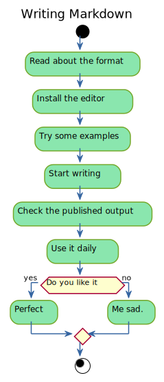
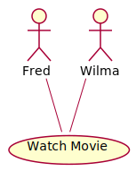
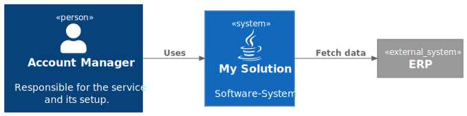
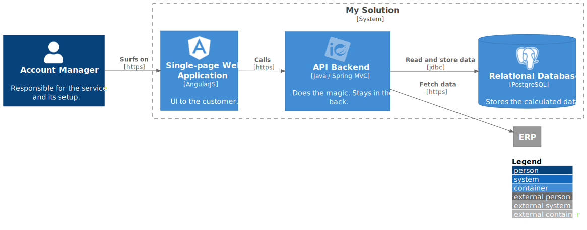

## Markdown + PlantUML <br/>vs. <br/>Word, Visio,

Omnigraffle, Drawio, PowerPoint, ...

---

## About my personal motivation to document

--

## Anti-patterns first: <br/>bad reasons for documenting

- It's required by a higher force.
- It's the only way to know what the thing does.

--

## Things you could do instead of documenting

- Write cleaner code
- Build a cleaner architecture
- Automate things

--

So who are you documenting for?{class="fragment fade-in-fade-out"}

--

### My reasons to document

<span class="fragment">It's a way of communication</span>
<span class="fragment"> ... with other people you may never meet</span>
<span class="fragment"> ... or even your future self.</span>

So I'd like them to be thankful for what I told them.{class="fragment"}

<small class="fragment zoom-in">Also I love text editors!</small>

---

## TXT is maximum compatible

Independent from platforms and tools.

--

### Documentation as code

> Documentation as Code (Docs as Code) refers to a philosophy that you should be writing documentation with the same tools as code.

[Write The Docs](https://www.writethedocs.org/guide/docs-as-code/)

--

### What's the toolchain again?

- Code editor / IDE,  
  e.g. IntelliJ, [VS Code](https://code.visualstudio.com/), vim, Notepad++
- Version Control System, e.g. <i class="fa fa-git"></i>
- Issue trackers, e.g. Jira

--

## Text files <br/>vs. <br/>nice looks

- <i class="fa fa-git"></i> + code editor ❤ text files
- text files ≠ fancy layouting and WYSIWYG 

> How do we solve this dilemma?{class="fragment"}

--

## Conventions to the rescue

- semantic text files
  - simple structure based on conventions
  - smart tools publish to various formats <i class="fa fa-html5"></i> <i class="fa fa-file"></i>
- [Markdown](https://de.wikipedia.org/wiki/Markdown), [Org-Mode](https://orgmode.org/), [Sphinx](https://www.sphinx-doc.org/en/master/)
- [PlantUML](https://plantuml.com/)
- [Mermaid.js](https://mermaid-js.github.io/mermaid)

---

## Markdown Basics

```{.markdown data-line-numbers="1-2|3-5|6-9|10-15|16-17|18-19|22-25|20-21"}
# Heading

A Paragraph. Tempor veniam ex excepteur veniam eu incididunt sint in officia Lorem nostrud minim.
Still the same paragraph.

1. List
2. List
3. List

- Loose List

- Loose List

- Loose List

{width=100%}

[Link text](https://link.url)

: Table caption

| Column a | Column b |
| ---      | ---      |
| Value 1  | Value 2  |
| Value 3  | Value 4  |

```

--

### More Markdown <br/>Footnotes

```{.markdown data-line-numbers="1|3|5-6"}
Laborum tempor irure aliqua tempor id.[^footnote-id]

[^footnote-id]: Footnote text

Id tempor sunt pariatur qui dolore 
anim consectetur.^[inline footnote text]

```

--

### More Markdown <br/>Code blocks

When you write code blocks in markdown:

~~~{.markdown}
```Javascript
var txt = "Hello World";
```
~~~

<span class="fragment">
it get's highlighted later in HTML or PDF:

```Javascript
var txt = "Hello World";
```
</span>

--

### Publish to target formats

**Recommendation:**  
[Pandoc](https://pandoc.org/) can be your swiss army knife of conversion.

**Examples**:

- Markdown → HTML5, PDF, Word, PowerPoint
- You may also like Markdown → Jira (and back again){class="fragment fade-left"}
- How about Markdown to ePub or man pages?{class="fragment fade-left"}
- Even MS Word → Markdown is possible{class="fragment fade-left"}

--

### Invest in Markdown

- With less than 10 simple conventions you can write full documents{class="fragment fade-left"}
- Renderers will create nice looking target formats like HTML5 or PDF{class="fragment fade-left"}
- Re-use your markdown for different types of documents: specs, presentations, to-do lists, meeting minutes.{class="fragment fade-left"}

---

## What about diagrams?

{width=20%}

--

### PlantUML

- You write structured (sematic) text files
- You get auto-layouted, graphical representations als PNG, SVG, EPS, PDF, ...
- You can version/diff/pull-request them like code

--

### PlantUML usecase

```
@startuml
actor Fred
actor Wilma

usecase "Watch Movie" as movie

Fred - movie
Wilma - move
@enduml
```

<span class="fragment">this ↑ code</span>
<span class="fragment fade-up"> creates this ↓ diagram </span>

{width="16%" class="fragment fade-up" style="background:white;border-radius: 5px;"}

--

### C4-Architecture at Level 1 » Context

```{data-line-numbers="1,11|2-3|4|5|6-7|8-9"}
@startuml C4 Level 1 System Context diagram
!include <C4/C4_Context.puml>
!include <tupadr3/devicons2/java>
LAYOUT_LEFT_RIGHT()
Person(account_mgr, "Account Manager", "Responsible for the service and its setup.")
System(my_solution, "My Solution", "Software-System", "java")
System_Ext(erp, "ERP")
Rel(account_mgr, my_solution, "Uses")
Rel(my_solution, erp, "Fetch data")
@enduml
```

--

### C4-Architecture at Level 1 » Context

{style="background: rgb(82%, 80%, 74.1%); border-radius: 5px; padding: 0.2em;"}

--

### C4-Architecture at Level 2 » Container

```{data-line-numbers="1,20|2-5|6-7|8|9-13|14|15-18"}
@startuml C4 Level 2 System Container Diagram
!include <C4/C4_Container>
!include <logos/spring.puml>
!include <tupadr3/devicons2/angularjs>
!include <tupadr3/devicons2/postgresql>
LAYOUT_WITH_LEGEND()
LAYOUT_LEFT_RIGHT()
Person(account_mgr, "Account Manager", "Responsible for the service and its setup.")
System_Boundary(my_solution, "My Solution"){
    Container(webapp, "Single-page Web Application", "AngularJS", "UI to the customer.", "angularjs")
    Container(api, "API Backend", "Java / Spring MVC", "Does the magic. Stays in the back.", "spring")
    ContainerDb(db, "Relational Database", "PostgreSQL", "Stores the calculated data.","postgresql")
}
System_Ext(erp, "ERP")
Rel(account_mgr, webapp, "Surfs on", "https")
Rel(webapp, api, "Calls","https")
Rel(api, db, "Read and store data", "jdbc")
Rel(api, erp, "Fetch data", "https")
@enduml
```

--

### C4-Architecture at Level 2 » Container

{style="background: rgb(82%, 80%, 74.1%); border-radius: 5px; padding: 0.2em;"}

---

## Putting it all together

- Markdown for text/lists/tables
- PlantUML for diagrams
- Other media for PNG/SVG/EPS content
- Publish to different formats for different purposes
- Version control and content re-use

--

### The tool stack

- [VS Code](https://code.visualstudio.com/) for editing{class="fragment fade-left"}
- [Pandoc](https://pandoc.org/MANUAL.html) for conversions{class="fragment fade-left"}
  - Filters + templates for optimal output{class="fragment fade-left"}
- [MiKTeX](https://miktex.org/) (Windows) for PDF creation{class="fragment fade-left"}
- [PlantUML](https://plantuml.com/) + [Graphviz](https://graphviz.org/) for diagrams{class="fragment fade-left"}

--

### My personal Pandoc setup and extensions

- [Eisvogel LaTeX template](https://github.com/Wandmalfarbe/pandoc-latex-template) for PDFs{class="fragment fade-left"}
- [GitHub template](https://github.com/tajmone/pandoc-goodies) for HTML5{class="fragment fade-left"}
- [Python](https://www.python.org/) Filters for{class="fragment fade-left"}
  - [PlantUML from inside Markdown](https://github.com/timofurrer/pandoc-plantuml-filter) support{class="fragment fade-left"}
  - [LaTeX environment](https://github.com/chdemko/pandoc-latex-environment) for info/warning admonitions in PDF{class="fragment fade-left"}
- VS Code extensions for [Pandoc](https://marketplace.visualstudio.com/items?itemName=yzhang.markdown-all-in-one), [PlantUML](https://marketplace.visualstudio.com/items?itemName=jebbs.plantuml), etc.{class="fragment fade-left"}

---

## Aftermath / the downsides

... not the best way to end the presentation. 😱{class="fragment fade-out"}

- Conventions are still changing. You documents may break.{class="fragment fade-left"}
- You need to look up details on the web.{class="fragment fade-left"}
- The Setup requires a lot of local tweaking, especially when you also want snippets, code completion, linting, etc.{class="fragment fade-left"}
- You'll mostly work mouseless, which in itself is not everybody's cup of tea.{class="fragment fade-left"}

--

<h3 class="fragment fade-down">I 💜 having different tools.</h3>

I 💜 my Gimp, Blender, LightRoom, Word, Excel, etc.{class="fragment fade-left"}

<h3 class="r-fit-text fragment fade-up" style="color: rgb(74.9%, 60.8%, 87.1%)">But when comes to writing docs,  
I'm never going back!</h3>

<small class="fragment fade-right">I may only switch the format.</small>
<small class="fragment fade-left"> I'm looking at you, Org-mode!</small>

{width=30%, class="fragment"}

---

## About these slides

They were created using Markdown and [Reveal.js](https://revealjs.com/).

Editing done in Visual Studio Code with a [Reveal extension](https://marketplace.visualstudio.com/items?itemName=tokiedokie.reveal-markdown).

Slide sources available at [my <i class="fa fa-github"></i> GitHub page](https://github.com/gengor-git/documentation-as-code/).