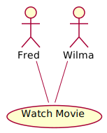

# Markdown + PlantUML <br/>vs. <br/>Word, Visio,

Omnigraffle, Drawio, PowerPoint, ...

---

# The idea behind documentations

Why should you write something down in the first place?

--

## Bad reasons for documenting

- It's required by a higher force.
- It's the only way to know what the thing does.

--

## Things you could do instead of documenting

- Write clean(er) code
- Automate more

--

### My view on writing things down

<span class="fragment">It's a way of communication</span>
<span class="fragment"> ... with other people you may never meet</span>
<span class="fragment"> ... or even your future self.</span>

So I'd like them to be thankful for what I told them.{class="fragment"}

---

# Documentation as code

[Write The Docs](https://www.writethedocs.org/guide/docs-as-code/)

> Documentation as Code (Docs as Code) refers to a philosophy that you should be writing documentation with the same tools as code.

--

# What tools do we use?

- Code editor / IDE,  
  e.g. IntelliJ, VS Code, vim, Notepad++
- Version Control System, e.g. <i class="fa fa-git"></i>
- Issue tracker, e.g. Jira

--

# Text files <br/>vs. <br/>nice looks

- <i class="fa fa-git"></i> + IDE → text files
- text files ≠ fancy layouting

--

## Conventions to the rescue

- semantic text files
  - simple structure based on conventions
  - can be published to various formats <i class="fa fa-html5"></i> <i class="fa fa-file"></i>
- [Markdown](https://de.wikipedia.org/wiki/Markdown), [Org-Mode](https://orgmode.org/), [Sphinx](https://www.sphinx-doc.org/en/master/)
- [PlantUML](https://plantuml.com/)
- [Mermaid.js](https://mermaid-js.github.io/mermaid)

---

### Markdown Basics

```{.markdown data-line-numbers="1-2|3-5|6-9|10-15|16-17|18-19|22-25|20-21"}
# Heading

A Paragraph. Tempor veniam ex excepteur veniam eu incididunt sint in officia Lorem nostrud minim.
Still the same paragraph.

1. List
2. List
3. List

- Loose List

- Loose List

- Loose List

{width=100%}

[Link text](https://link.url)

: Table caption

| Column a | Column b |
| ---      | ---      |
| Value 1  | Value 2  |
| Value 3  | Value 4  |

```

--

### More Markdown <br/>Footnotes

```{.markdown data-line-numbers="1|3|5-6"}
Laborum tempor irure aliqua tempor id.[^footnote-id]

[^footnote-id]: Footnote text

Id tempor sunt pariatur qui dolore 
anim consectetur.^[inline footnote text]

```

--

### More Markdown <br/>Code blocks

When you write code blocks in markdown:

~~~{.markdown}
```Javascript
var txt = "Hello World";
```
~~~

<span class="fragment">
it get's highlighted later in HTML or PDF:

```Javascript
var txt = "Hello World";
```
</span>

--

## Publish to target formats

Recommendation:  
[Pandoc](https://pandoc.org/) can be your swiss army knife of conversion.

--

# Conclusion

- With less than 10 simple convetions you can write full documents
- Renderers will create nice looking target formats like HTML5 or PDF
- Reuse your markdown e.g. different types of documents: specs vs. presentations

---

## PlantUML & Mermaid.js

- You write structured (sematic) text files
- You get auto-layouted, graphical representations als PNG, SVG, EPS, PDF, ...
- You can version/diff/pull-request them like code

--

<!-- .slide: data-background="#f1e4cd" -->

PlantUML

```
@startuml
actor Fred
actor Wilma

usecase "Watch Movie" as movie

Fred - movie
Wilma - move
@enduml
```

<span class="fragment">this ↑ code</span>
<span class="fragment fade-up"> creates this ↓ diagram </span>

{width=20% class="fragment fade-up"}

--

<!-- .slide: data-background="#d6d4f9" -->

### C4-Architecture with PlantUML Level 1

```{data-line-numbers="1|2-5|6|7|8-9|10-11|12"}
@startuml C4 Level 1 System Context diagram
!include <C4/C4_Context.puml>
!include <logos/spring.puml>
!include <tupadr3/devicons2/angularjs>
!include <tupadr3/devicons2/java>
LAYOUT_LEFT_RIGHT()
Person(account_mgr, "Account Manager", "Responsible for the service and its setup.")
System(my_solution, "My Solution", "Software-System", "java")
System_Ext(erp, "ERP")
Rel(account_mgr, my_solution, "Uses")
Rel(my_solution, erp, "Fetch data")
@enduml
```

--

<!-- .slide: data-background="#d6d4f9" -->

C4-Architecture with PlantUML » Level 1


--

<!-- .slide: data-background="#98dacb" -->

### C4-Architecture with PlantUML Level 2

```{data-line-numbers="1|2-6|7-8|9|10-14|15|16-19|20"}
@startuml C4 Level 2 System Container Diagram
!include <C4/C4_Container>
!include <logos/spring.puml>
!include <tupadr3/devicons2/angularjs>
!include <tupadr3/devicons2/java>
!include <tupadr3/devicons2/postgresql>
LAYOUT_WITH_LEGEND()
LAYOUT_LEFT_RIGHT()
Person(account_mgr, "Account Manager", "Responsible for the service and its setup.")
System_Boundary(my_solution, "My Solution"){
    Container(webapp, "Single-page Web Application", "AngularJS", "UI to the customer.", "angularjs")
    Container(api, "API Backend", "Java / Spring MVC", "Does the magic. Stays in the back.", "spring")
    ContainerDb(db, "Relational Database", "PostgreSQL", "Stores the calculated data.","postgresql")
}
System_Ext(erp, "ERP")
Rel(account_mgr, webapp, "Surfs on", "https")
Rel(webapp, api, "Calls","https")
Rel(api, db, "Read and store data", "jdbc")
Rel(api, erp, "Fetch data", "https")
@enduml
```

--

<!-- .slide: data-background="#98dacb" -->

C4-Architecture with PlantUML » Level 2


---


